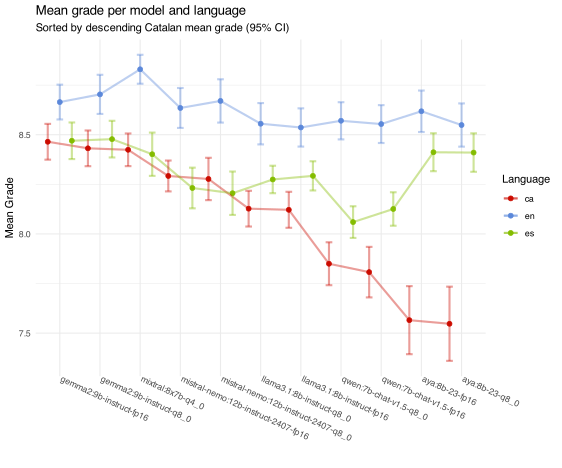
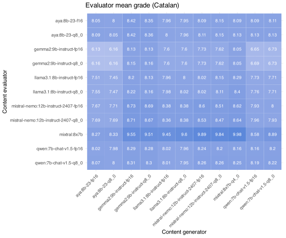

# Quin model lliure (<12B) escriu *millor* en català?

## Introducció

Cada setmana apareixen nous i millors models de llenguatge extens ([LLM](https://ca.wikipedia.org/wiki/Model_de_llenguatge_extens)). Sovint estan entrenats en diferents llengües, però no sempre són capaços d'escriure correctament en català.

En aquest estudi es desitja *auto*-avaluar diferents models per esbrinar quin és el que escriu millor en català. Per fer-ho, s'han escollit diferents models lliures populars, com ara **Llama3.1**, **Gemma2**, o **Mixtral**. A la vegada també s'han avaluat diferents variants de quantització per esbrinar en quin grau aquesta característica impacta la qualitat del text generat.

Addicionalment, el procés descrit a continuació s'ha adaptat i traduït al castella i a l'anglès per esbrinar si hi havia diferències significatives entre els tres idiomes.

L'interès d'aquesta prova rau en avaluar models que es puguin executar localment (en aquest cas mitjançant el programari lliure [**ollama**](https://ollama.com])). En el cas que ens ocupa, s'ha executat tot en una màquina que disposa d'una única tarja RTX 4090 amb 24GB de memòria VRAM.

## Models avaluats

En aquest estudi s'han avaluat els següents models:

* Llama3.1-8B (fp16 i q8_0)
* Gemma2-9B (fp16 i q8_0)
* Mistral-Nemo-12B (fp16 i q8_0)
* Aya-8B-23 (fp16 i q8_0)
* Qwen-v1.5-7B (fp16 i q8_0)
* Mixtral-8x7B (q4_0)

**NOTA**: És important destacar que els models de [Mistral](https://www.mistral.ai) (tant Nemo-12B com Mixtral-8x7B) no acaben de cabre en 24GB de memòria en les versions sense quantitzar. De fet, la versió utilitzada de Mixtral és *q4_0*. Tot i així, aquests s'han inclòs igualment en la prova per poder veure com es comporten generant text en català ja que es tracten de models lliures populars.

**NOTA 2**: També és important destacar que es coneix de l'existència dels models lliures del **Projecte Aina**, disponibles a [HuggingFace](https://huggingface.co/projecte-aina), i de la feina per [@xaviviro](https://huggingface.co/xaviviro) per crear un model *GGUF* *instruct* en català. No obstant això, aquests no s'han utilitzat en aquesta prova donat que la instal·lació en **ollama** no és immediata. En un futur, aquests també es podrien tenir en compte.

## Metodologia

Per obtenir els diferents models a **ollama** s'ha executat la comanda:

```
$ ollama pull <model>
```

Tots els models es poden descarregar de la pàgina oficial d'**ollama**, concretament a la secció de **Models**.

Per avaluar els diferents models s'han avaluat les següents tasques mitjançant l'*script* **python** (**cat-eval.py**) proporcionat en el repositori.

#### Tasca 1: Temàtica

S'han proporcionat 11 temàtiques diferents sobre les que escriure un text de 150 paraules. Un exemple d'indicació (*prompt*) seria: 

> Escriu un text en català de 150 paraules sobre els beneficis de la lectura habitual.

#### Tasca 2: Generació de text

Amb cada model, en cadascuna de les variants de quantització, en cadascun dels idiomes, i amb temperatura a **0.8**, s'ha generat el text corresponent.

A continuació es mostra un exemple generat pel model **Mixtral-8x7B** amb força errors que pot ajudar a intuir la qualitat del model:

> La lectura habitual ofereix una gran quantitat d'beneficis, tant per a la ment com per a l'ànima. Primerament, pot millorar les capacitats cognitives i la creativitat, ja que obliga a utilitzar la imaginació per visualitzar personatges i escenaris. A més, augmenta el vocabulari i millora l'ortografia i la gramàtica, cosa que resulta molt útil per aprendre noves llengües o per desenvolupar habilitats comunicatives en la vida quotidiana.
>
>La lectura habitual també pot reduir l'estrès i promoure la relajació, ja que permet escapar de les preocupacions del dia a dia i sumir-se en un món diferent. A més, els estudis han demostrat que la lectura regular pot ajuda a dormir millor, ja que prepara el cervell per a l'hora de descansar.
>
>Per altra banda, la lectura habitual pot augmentar l'empatia i la comprensió cap a les altres persones, ja que permet posar-se en la pell dels personatges i experimentar situacions diferents a les pròpies. A més, pot estimular el pensament crític i l'anàlisi, ja que obliga a reflexionar sobre els arguments i les decisions dels personatges. Finalment, la lectura habitual pot ser una font d'inspiració i coneixement, ja que permet accedir a una gran quantitat d'idees i perspectives diferents. En definitiva, la lectura regular és una activitat gratificant i beneficiosa per a tothom, independentment de l'edat o dels interessos personals.

#### Tasca 3: *Auto*-Avaluar el text generat

Els texts generats s'han avaluat a partir de la següent rúbrica (traduïda a cada idioma de manera corresponent), amb temperatura a **0.0**:

> Ets un avaluador d'expressió escrita en català. La teva tasca és posar una nota entre el 0 i el 10 al text entre els delimitadors ### RESPOSTA ### seguint la rúbrica a continuació:
>
>- Ortografia, gramàtica i puntuació:
>    * Sense errors: 3
>    * Amb errors menors: 2
>    * Amb algunes errades significatives: 1
>    * Amb moltes errades greus: 0
>
>- Estructura de les frases:
>    * Fragments molt variats i ben construïts: 3
>    * Fragments amb alguna dificultat però en general bé: 2
>    * Fragments amb algunes construccions errònies o difícils: 1
>    * Fragments amb moltes errades o sense sentit: 0
>
>- Coherència:
>    * Text molt coherent i clar: 3
>    * Text en general coherent però amb alguns dubtes: 2
>    * Text amb algunes dificultats de coherència: 1
>    * Text incoherent o difícil de seguir: 0
>
>Retorna NOMÉS un valor numèric entre 0 i 10 en format JSON segons   l'avaluació de la rúbrica. Exemples de valors vàlids: {{"nota": "9" }}, {{"nota": "6" }}, {{"nota": "4" }}.
>    
>No afegeixis comentaris, explicacions ni res més, només el JSON amb la nota. Tampoc afegeixis formatació de sortida amb ```.
>    
>Això és el que es va demanar als estudiants: "{question}".
>    
>###{answer}###

#### Tasca 4: Emmagatzemar el contingut generat

Tot el contingut generat i les avaluacions s'han desat en una base de dades SQLite3, anomenades **\<lang\>-eval.db** per a cada idioma respectivament. A continuació s'ha fet un anàlisi descriptiu senzill.

## Resultats

Els resultats obtinguts són els següents:

* S'han generat **605** texts diferents (11 models, 11 temàtiques i 5 repeticions) per cada idioma.
* S'han generat **6650** avaluacions. Cadascun dels 11 models ha avaluat els 605 texts generats (11 * 605) per cada idioma. 

Es podria avaluar si és vàlid que un model avaluï els seus propis texts, però no sembla haver-hi *favoritisme* en aquest sentit.

#### Qualitat del model

El ranking dels models *auto*-avaluats ha estat el següent:

|  #|model                               |   ca| ca_sd|   en| en_sd|   es| es_sd|
|--:|:-----------------------------------|----:|-----:|----:|-----:|----:|-----:|
|  **1**|**gemma2:9b-instruct-fp16**             | **8.46**|  0.33| 8.66|  0.32| 8.47|  0.34|
|  **2**|**gemma2:9b-instruct-q8_0**             | **8.43**|  0.33| 8.70|  0.36| 8.48|  0.34|
|  **3**|**mixtral:8x7b-q4_0**                   | **8.42**|  0.30| 8.83|  0.27| 8.40|  0.40|
|  4|mistral-nemo:12b-instruct-2407-fp16 | 8.29|  0.29| 8.63|  0.37| 8.23|  0.38|
|  5|mistral-nemo:12b-instruct-2407-q8_0 | 8.28|  0.39| 8.67|  0.40| 8.20|  0.40|
|  6|llama3.1:8b-instruct-q8_0           | 8.13|  0.33| 8.56|  0.38| 8.27|  0.26|
|  7|llama3.1:8b-instruct-fp16           | 8.12|  0.34| 8.54|  0.36| 8.29|  0.27|
|  8|qwen:7b-chat-v1.5-q8_0              | 7.85|  0.40| 8.57|  0.35| 8.06|  0.30|
|  9|qwen:7b-chat-v1.5-fp16              | 7.81|  0.47| 8.55|  0.35| 8.13|  0.31|
| 10|aya:8b-23-fp16                      | 7.57|  0.63| 8.62|  0.39| 8.41|  0.35|
| 11|aya:8b-23-q8_0                      | 7.55|  0.69| 8.55|  0.40| 8.41|  0.36|

S'observa que els dos millors models en català han estat **gemma2:9b-instruct-fp16** i **gemma2:9b-instruct-q8_0**, amb una nota mitjana de **8.46** i **8.43** respectivament, seguits de **mixtral:8x7b**.



Els resultats dels dos models de la família **Gemma2** són molt similars, amb una diferència de menys d'un punt en la nota mitjana i una desviació típica similar. Això, tractant-se del *mateix* model, era d'esperar. En altres models, com per exemple **Qwen**, *fp16* no ha estat sempre millor que *q8_0*, però, de nou, les diferències són mínimes entre models de la mateixa família.

La diferència entre variants de quantització és que **gemma2:9b-instruct-q8_0** té una mida força més petita, cap millor en VRAM i presenta una velocitat de generació superior, mentre que **gemma2:9b-instruct-fp16** té una mida de model força més gran i, *teòricament*, hauria de mostrar una millor qualitat general, cosa que no s'aprecia especialment.

Els dos models són bons i haurien de poder ser utilitzats per a la generació de text en català. Es recomanaria escollir **gemma2:9b-instruct-q8_0**, ja que el model és més ràpid i eficient pel que fa als recursos disponibles.

En la taula també s'inclouen els resultats de les variants en anglès i castellà. Com era d'esperar tots els models mostren millors resultats en castellà i en anglès. El millor model en anglès es **Mistral-8x7B**, mentre que el millor model en castellà és **gemma2:9b-instruct-q8_0**. En tots els casos, però, la família de models **Gemma2** són els *millors* models aplicables en les condicions d'execució local amb una RTX 4090 amb 24 GB de VRAM.

És interessant comentar que cada model avalua els texts generats de manera força diferent tot i aplicar la mateixa rúbrica. Per exemple, el model **Mixtral-8x7B** (i Mistral, en general) acostuma a valorar els textos generats amb una nota més alta que els altres models, mentre que els models **Gemma2**, per exemple, acostumen a valorar els texts generats amb una nota força més baixa de mitjana. Com a referència es mostra a continuació les notes mitjanes d'avaluació de cada model en català.

\# | avaluador | nota mitjana | sd
-|-|-:|-:
**1** | **mixtral:8x7b-q4_0** | **9.26** | **0.907**
2 | mistral-nemo:12b-instruct-2407-fp16 | 8.29 | 0.792
3 | mistral-nemo:12b-instruct-2407-q8_0 | 8.28 | 0.790
4 | qwen:7b-chat-v1.5-q8_0 | 8.16 | 0.449
5 | aya:8b-23-q8_0 | 8.14 | 0.746
6 | qwen:7b-chat-v1.5-fp16 | 8.14 | 0.419
7 | aya:8b-23-fp16 | 8.11 | 0.743
8 | llama3.1:8b-instruct-q8_0 | 7.95 | 0.720
9 | llama3.1:8b-instruct-fp16 | 7.92 | 0.699
**10** | **gemma2:9b-instruct-q8_0** | **7.33** | **0.985**
**11** | **gemma2:9b-instruct-fp16** | **7.32** | **0.990**



#### Mida de les respostes

En quant a la llargada mitjana dels texts generats (en paraules en català), la classificació és la següent:

\# | model | mida mitjana | sd
-|-|-:|-:
1 | mistral-nemo:12b-instruct-2407-fp16 | 277. | 59.2
2 | mistral-nemo:12b-instruct-2407-q8_0 | 266. | 50.9
3 | mixtral:8x7b-q4_0 | 256. | 31.0
4 | aya:8b-23-fp16 | 195. | 47.4
5 | aya:8b-23-q8_0 | 186. | 46.1
6 | llama3.1:8b-instruct-fp16 | 172. | 47.4
7 | llama3.1:8b-instruct-q8_0 | 170. | 38.6
**8** | **gemma2:9b-instruct-q8_0** | **144.** | **14.1**
**9** | **gemma2:9b-instruct-fp16** | **144.** | **13.6**
10 | qwen:7b-chat-v1.5-q8_0 | 138. | 25.9
11 | qwen:7b-chat-v1.5-fp16 | 133. | 28.4

S'observa que els dos millors resultats, de nou, corresponen als models de la família **Gemma2**. És curiós observar que pocs models s'acosten a la mida de 150 paraules que s'especifica en l'enunciat del text a generar. Mistral Nemo, per exemple, arriba gairebé al doble de contingut generat de mitjana.

## Conclusions

En aquest estudi s'ha realitzat una comparativa entre diferents models lliures i executables localment. Són models que no necessiten requeriments de maquinari extraordinaris. S'han analitzat les seves capacitats en la generació de text en català, i addicionalment en anglès i castellà per avaluar les diferències.

Els millors resultats els han obtingut els models de la família **Gemma2**. És interessant fer notar que els resultats els posicionen just per sobre d'un model força més *potent*, com és **Mixtral-8x7B**, encara que la diferència sigui mínima.

S'ha observat també que les valoracions dels texts generats canvien significativament quan els textos s'han generat en castellà i anglès. Això era d'esperar ja que els models estan entrenats principalment en anglès, seguit d'altres idiomes com el castellà. En aquest sentit ha esta interessant veure la *gran* diferència entre el català i els altres idiomes en els model **Qwen** d'Alibaba Cloud i **Aya** de Cohere que es presenta com un model multi-llenguatge amb 23 llengües d'entrenament.

## Material inclòs al repositori

En el repositori s'inclou el codi **python** i **R** per poder reproduir l'execució. Donat que no hi ha llavor d'execució es fa complexe obtenir els mateixos resultats. Tot i així, s'inclou la base de dades SQLite3 amb els resultats obtinguts en l'execució i comentats prèviament.

En l'arxiu **analysis-lm.R** s'inclouen també tests estadístics addicionals que permeten determinar les diferències significatives entre models i idiomes.